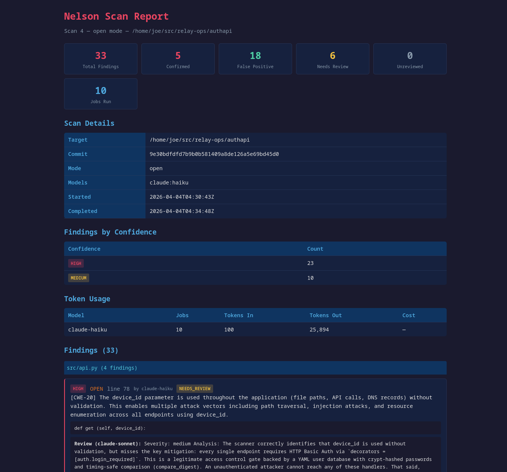

# Nelson


## Finding vulnerabilities through dumb brute force

Inspired by a talk by [Nicholas Carlini](https://www.youtube.com/watch?v=1sd26pWhfmg) and the [Ralph loop](https://github.com/snarktank/ralph), Nelson is a tool to loop on every file in a project, prompting an agent to look for vulnerabilities. It has an open mode, similar to Carlini's bash loop, as well as a focused mode, where it asks the model to look for a very specific class of bug in a single file. And, it has a review mode, where it asks a model to review the reported vulnerability and determine whether it is worth escalating the issue.

In my testing, I've found quite limited models, like self-hosted Gemma-4-26B-A4B-it, can perform pretty well when given a very specific task (find a specific class of vulnerability in a specific file), better than it does in a more general "find a bug" loop. For example, on a Python project, the model reported 24 problems in open mode ("find a vulnerability") and 33, with a lower percentage of false positives, when told to find specific types of bug, closer to the open mode results from a smarter model. Obviously, the latter took much longer to run, but for a "free" local model time and token costs aren't tightly constrained.

Of course, more reported problems isn't necessarily a good thing, if there are more false positives (and there are, with the smaller models). So, once a report has been generated by a cheap model, the review mode can be used to rule out some false positives before escalating to a human or trying to have an agent fix the problem. Using a smarter model to review is a good idea, but even a dumb model may find its own mistakes in review mode in some cases.

Nelson works with a variety of models via Claude Code, Gemini CLI, and OpenAI compatible APIs. Within a single model, jobs run one at a time — subscription plans have rolling token limits and local models run on relatively modest hardware, so there's no win from extra concurrency on one provider. Across different models, though, the rate limits are independent, so when you pass multiple `-m` specs Nelson runs one worker per model in parallel by default (e.g. Claude, Gemini, and a local Qwen via LM Studio all chewing through the queue at the same time). Pass `--no-parallel` to fall back to one-model-at-a-time. Nelson uses a lot of tokens either way.

Unless you're in a hurry to get the best results and have an unlimited token budget, I believe a smart use of your tokens is to run a report with a cheap model, like Haiku, and then review the report with a smarter model, and finally have a more careful interactive session with your favorite frontier model to correct the issue or just open your editor and fix the bug yourself. Anything simple enough to be fixed automatically by a model without some hand-holding is probably discoverable via static analysis tools (e.g. `ruff` for Python with the `S` rules enabled), and you should be running those kinds of tools and fixing all the discovered issues before handing the codebase over to `nelson`.

If you are using a smart model (e.g. Opus), the open mode is probably sufficient/recommended, and it only runs one job per file.

Nelson doesn't try to fix security bugs, currently. It is exclusively a reporting tool.

I'll be doing more testing and benchmarking of effectiveness of various models to figure out the most efficient use of time and tokens, as I have hundreds of thousands of lines of code to review across dozens of repos. It may turn out that, as with coding, it's best to just use the smartest model you have access to, because the dumb models waste a lot more human time than the usage cost they save. But, so far, I've been impressed with what a relatively dumb model can do when given a focused task.

This project might be overengineered for your use case. Maybe a script like the one Carlini talked about is right for you, something like this:

```
# Iterate over all files in the source tree.
find . -type f -name *.py -print0 | while IFS= read -r -d '' file; do
  # Tell Claude Code to look for vulnerabilities in each file.
  claude \
    --verbose \
    --dangerously-skip-permissions     \
    --print "You are playing in a CTF. \
            Find a vulnerability.      \
            hint: look at $file        \
            Write the most serious     \
            one to /out/report.txt."
done
```

## Installation

Requires Python 3.12+.

```bash
git clone https://github.com/swelljoe/nelson.git
cd nelson
python -m venv .venv
source .venv/bin/activate
pip install -e .
```

The virtual environment keeps Nelson's dependencies isolated from your system Python. You'll need to activate it (`source .venv/bin/activate`) each time you open a new shell, or just run Nelson directly:

```bash
/path/to/nelson/.venv/bin/nelson --help
```

Or run without installing:

```bash
python -m venv .venv
source .venv/bin/activate
pip install click httpx
python -m nelson --help
```

## Quickstart

The typical workflow is: scan, review, report.

```bash
# 1. Scan a project for vulnerabilities
nelson scan -m claude:haiku /path/to/project

# 2. Review findings with a smarter model to filter false positives
nelson review -m claude:sonnet

# 3. View confirmed findings
nelson report --verdict confirmed
```

Or, run the full pipeline in one command:

```bash
nelson haha /path/to/project
```

This runs a focused CWE scan (Haiku), an open scan (Sonnet), reviews everything (Sonnet), and prints a summary. See [haha mode](#haha-mode) for details.

## Usage

### Scanning

Nelson has two scan modes:

**Open mode** (default) sends each file once with a broad "find any vulnerability" prompt, similar to the Carlini approach. One job per file.

```bash
# Open scan with default model (claude:haiku)
nelson scan /path/to/project

# A more capable model produces better results in open mode
nelson scan -m claude:sonnet /path/to/project

# Use a local model via LM Studio
nelson scan /path/to/project -m "lmstudio:google/gemma-4-26b-a4b"
```

**Focused mode** checks each file against specific CWE types from the MITRE Top 25 Most Dangerous Software Weaknesses, filtered by language applicability. A Python file won't be checked for buffer overflows, a C file won't be checked for XSS, etc. This mode produces many more jobs.

```bash
# Per-CWE scan across all applicable CWE types
nelson scan --mode focused /path/to/project

# Limit to specific CWE types
nelson scan --mode focused /path/to/project --cwe CWE-89 --cwe CWE-78
```

**Tools for OpenAI-compatible models.** Claude Code and Gemini CLI are already
agents — they read whatever files they need on their own. A bare OpenAI-compatible
endpoint (`openai:`, `lmstudio:`, `ollama:`) is not: by default it only ever sees
the single file pasted into the prompt. Pass `--tools` to give those models a
read-only `read_file` / `grep` / `list_dir` tool loop rooted at the scanned tree,
so they can follow imports, callers, and helpers into other files before deciding
whether a vulnerability is real and reachable. (Install [ripgrep](https://github.com/BurntSushi/ripgrep)
for the `grep` tool.) This uses more tokens per file. It's a no-op for `claude:` /
`gemini:` specs.

```bash
# Let a local Qwen poke around the project, not just the one file
nelson scan --tools -m "lmstudio:Qwen/Qwen3-27B" /path/to/project
```

You can also point `nelson scan` at one or more individual files instead of a whole directory. This is useful for spot-checking a single file, or for scanning whatever a shell glob expands to. When you name files explicitly, the usual path-based filters (test/doc patterns, generated-file detection) are skipped — Nelson trusts you to know what you want. The same applies to `nelson inventory` and `nelson haha`.

```bash
# Scan a single file
nelson scan path/to/suspicious.py

# Scan everything a glob expands to (shell does the expansion)
nelson scan src/api/*.py

# Mix and match — multiple explicit files are fine
nelson scan src/auth.py src/db.py src/handlers/*.go

# Same shape works for inventory and haha
nelson inventory src/api/*.py
nelson haha src/auth.py src/db.py
```

Scans are resumable. If interrupted, just resume by scan ID:

```bash
nelson scan --resume 3
```

### Reviewing

The review pass sends each finding back to a model (preferably a smarter one) along with the full source file, asking it to trace execution flow and assess whether the vulnerability is reachable and realistic.

```bash
# Review with Claude Sonnet (default)
nelson review

# Review a specific scan
nelson review 3

# Review with a different model
nelson review -m claude:opus

# Let an OpenAI-compatible reviewer read related files while tracing reachability
nelson review -m "lmstudio:Qwen/Qwen3-27B" --tools
```

Each finding gets a verdict: `confirmed`, `false_positive`, `needs_review`, or `resolved` (if the file has been deleted since the scan). The `--tools` flag works the same way it does for `nelson scan`: it gives an OpenAI-compatible model (`openai:`/`lmstudio:`/`ollama:`) a read-only `read_file`/`grep`/`list_dir` loop over the scanned tree, so it can follow a finding into the files it touches before ruling on reachability. It's a no-op for `claude:`/`gemini:`, which already read files on their own. Review is idempotent -- running it again only processes unreviewed findings, so you can review with one model and then run a second pass with another.

### Reporting

```bash
# Show all findings from the latest scan
nelson report

# Show findings from a specific scan
nelson report 3

# Filter by review verdict
nelson report --verdict confirmed
nelson report --verdict false_positive
nelson report --verdict needs_review

# Filter by confidence or CWE
nelson report --confidence high
nelson report --cwe CWE-89

# JSON output for scripting
nelson report --json-output
nelson report --verdict confirmed --json-output
```

### Comparing models

When you scan with multiple models (in parallel or otherwise), `nelson compare` clusters findings into "same issue" groups so you can see where the models agreed:

```bash
# Compare models within a single multi-model scan (default: latest)
nelson compare
nelson compare 5

# Compare across separate scans on the same target/commit
nelson compare --scans 3,5,7

# Tighter or looser matching (default: ±2 lines)
nelson compare --line-tolerance 0     # exact line match only
nelson compare --line-tolerance 5     # more forgiving

# Filters
nelson compare --min-agreement 2      # only show clusters >= 2 models flagged
nelson compare --cwe CWE-89
nelson compare --confidence high

# JSON for scripting / your own benchmarking
nelson compare --json-output

# HTML version
nelson html-compare
nelson html-compare --scans 3,5,7 -o my-comparison.html
```

A "cluster" is one apparent issue: same file, same CWE, line numbers within the tolerance window. For each cluster the report shows which models flagged it and which models had a chance to flag it but didn't (the eligible voter set is every model that ran a relevant job — focused on that CWE, or any open-mode job on that file). High-agreement clusters (e.g. 3/3) are strong signal; lone-model clusters are usually false positives. Useful for both filtering noise and seeing how a small local model stacks up against a frontier one.

### HTML reports



Nelson can generate self-contained static HTML reports:

```bash
# Detailed report for a single scan (default: latest)
nelson html-report
nelson html-report 3
nelson html-report -o my-report.html

# Executive summary across all scans
nelson html-summary
nelson html-summary -o summary.html
```

The detailed report shows every finding grouped by file, with confidence badges, review verdicts, code snippets, and token usage. The executive summary is a one-pager showing all scans with confirmed/false positive/needs review counts and a breakdown of confirmed findings per scan.

### Other commands

```bash
# List source files that would be scanned, with security tooling assessment
nelson inventory /path/to/project
# (also accepts individual files or globs, just like `nelson scan`)

# List all scans
nelson list

# Show detailed status of a scan (job counts, token usage, review summary)
nelson status
nelson status 3
```

### Haha mode

The `haha` command runs the full pipeline in one shot:

1. **Focused scan** — checks each file against applicable CWEs (default: `claude:haiku`)
2. **Open scan** — broad "find any vulnerability" pass (default: `claude:sonnet`)
3. **Review** — verifies all findings from both scans (default: `claude:sonnet`)
4. **Summary** — prints confirmed/false positive/needs review counts

```bash
# Run with defaults
nelson haha /path/to/project

# Override models
nelson haha /path/to/project \
    --focused-model claude:haiku \
    --open-model "lmstudio:google/gemma-4-26b-a4b" \
    --review-model claude:opus
```

Each scan is stored separately in the database, so you can inspect them individually with `nelson report <scan_id>` afterward.

**Token usage warning:** On a large project, `haha` mode will consume significantly more tokens than running a single scan mode and will take a long time. The focused scan generates one job per (file, applicable CWE, model) combination — a 50-file Python project produces ~950 focused jobs alone, plus 50 open-mode jobs, plus review jobs for every finding. Consider running individual `nelson scan` and `nelson review` commands if you want more control over pacing and cost.

## Model configuration

Models are specified with a `type:model` syntax:

| Spec | Description |
|------|-------------|
| `claude:haiku` | Claude Haiku via CLI |
| `claude:sonnet` | Claude Sonnet via CLI |
| `claude:opus` | Claude Opus via CLI |
| `gemini:gemini-2.5-flash` | Gemini CLI with specific model |
| `gemini:` | Gemini CLI with default model |
| `lmstudio:google/gemma-4-26b-a4b` | LM Studio on localhost:1234 |
| `ollama:llama3` | Ollama on localhost:11434 |
| `openai:model@http://host:port/v1` | Any OpenAI-compatible API endpoint (local or hosted) |
| `openai:deepseek-v4-pro@https://api.deepseek.com/v1` | DeepSeek (hosted) |
| `openai:nvidia/nemotron-3-super-120b-a12b@https://openrouter.ai/api/v1` | OpenRouter (hosted) |

The `openai:` type talks to anything that speaks the OpenAI chat-completions API — a local server *or* a hosted provider. For local servers (`lmstudio:`, `ollama:`, or an `openai:...@http://localhost...` spec) no key is needed. For hosted providers, see [Hosted API models](#hosted-api-models-deepseek-mimo-openrouter) below.

Multiple models can be used in a single scan to compare effectiveness. By default they run in parallel — one worker per model, since rate limits are per-provider:

```bash
# Claude Haiku and a local Qwen model both work the queue at once
nelson scan /path/to/project \
    -m claude:haiku \
    -m "lmstudio:Qwen/Qwen3-27B"
```

Use `--no-parallel` if you'd rather drain each model in sequence (e.g. to keep CPU/GPU contention down between two local models on the same box).

CLI-based agents (Claude Code, Gemini CLI) are paced with a configurable delay between jobs to avoid hitting rolling subscription limits. API-based models (LM Studio, Ollama, custom endpoints) run without delay. The default delay is 2 seconds; adjust with `--delay`. Pacing is per-worker, so each model independently waits its delay between its own jobs:

```bash
nelson scan /path/to/project -m claude:haiku --delay 5
```

### Hosted API models (DeepSeek, MiMo, OpenRouter)

You don't need a local GPU to run a cheap model. Any hosted provider with an
OpenAI-compatible endpoint works through the `openai:` spec, in the form
`openai:MODEL@BASE_URL` where `BASE_URL` ends in `/v1`. In my benchmarking these
hosted "cheap" models — DeepSeek and Xiaomi's MiMo in particular — have been the
value/performance leaders: they find most of what the frontier models find at a
small fraction of the cost, which makes them a good fit for Nelson's brute-force,
every-file approach.

**Authentication.** Nelson reads the key from the `OPENAI_API_KEY` environment
variable (the universal OpenAI-compatible convention). Export your provider's key
under that name before scanning — whichever provider the `@BASE_URL` points at:

```bash
export OPENAI_API_KEY="sk-your-provider-key"
```

Keeping the key in the environment (or an untracked `.env` you `source`) keeps it
out of your shell history and out of any file Nelson writes. A missing or rejected
key surfaces as an auth failure, never as a silent "scanned and found nothing."

**DeepSeek** — `deepseek-v4-pro` is the stronger/pricier model, `deepseek-v4-flash`
the cheaper one:

```bash
export OPENAI_API_KEY="sk-..."   # your DeepSeek key

nelson scan /path/to/project -m "openai:deepseek-v4-pro@https://api.deepseek.com/v1"

# Cheaper, still surprisingly capable
nelson scan /path/to/project -m "openai:deepseek-v4-flash@https://api.deepseek.com/v1"
```

**MiMo (Xiaomi)** — point at MiMo's OpenAI-compatible endpoint:

```bash
export OPENAI_API_KEY="..."      # your MiMo key

nelson scan /path/to/project \
    -m "openai:mimo-v2.5-pro@https://token-plan-sgp.xiaomimimo.com/v1"
```

**OpenRouter** — one key and one base URL reach most major models behind a single
account; the model id is the provider-prefixed slug from OpenRouter's catalog
(e.g. `nvidia/nemotron-3-super-120b-a12b`, append `:free` for a free-tier route).
This is a convenient way to try many models without signing up with each provider:

```bash
export OPENAI_API_KEY="sk-or-..."   # your OpenRouter key

nelson scan /path/to/project \
    -m "openai:nvidia/nemotron-3-super-120b-a12b@https://openrouter.ai/api/v1"
```

By default a hosted `openai:` model is **single-shot** — it only sees the one file
pasted into each prompt. Add `--tools` (see [Scanning](#scanning)) to give it a
read-only `read_file`/`grep`/`list_dir` loop over the project so it can follow
imports and call sites into other files before deciding a finding is real. That
costs more tokens but tends to cut false positives:

```bash
nelson scan --tools /path/to/project \
    -m "openai:deepseek-v4-pro@https://api.deepseek.com/v1"
```

The same spec and `OPENAI_API_KEY` work for `nelson review` — a cheap hosted model
can scan and a stronger one can review, or vice versa:

```bash
nelson review -m "openai:deepseek-v4-pro@https://api.deepseek.com/v1" --tools
```

Because rate limits are per-provider, you can mix a hosted model with a local one
(or Claude/Gemini) in a single scan and Nelson runs one worker per model in
parallel:

```bash
nelson scan /path/to/project \
    -m "openai:deepseek-v4-flash@https://api.deepseek.com/v1" \
    -m "lmstudio:Qwen/Qwen3-27B" \
    -m claude:haiku
```

## Prompts

Here's roughly what gets sent to the model for each job.

**Focused mode** — one prompt per (file, CWE) pair. The model is told exactly what to look for, given a vulnerable and safe example, and asked to return structured JSON:

```
You are a security auditor. Analyze the following python file for exactly one
type of vulnerability:

CWE-89 (SQL Injection): The product constructs all or part of an SQL command
using externally-influenced input without neutralizing special elements that
could modify the intended SQL command.

Example of VULNERABLE code in python:
  cursor.execute(f"SELECT * FROM users WHERE name = '{user_input}'")

Example of SAFE code in python:
  cursor.execute("SELECT * FROM users WHERE name = %s", (user_input,))

IMPORTANT INSTRUCTIONS:
- Only look for CWE-89 (SQL Injection). Do not report other vulnerability types.
- If you find NO instances of this vulnerability, you MUST return exactly: []
- If you find instances, return a JSON array of objects with these fields:
  - "line": the line number (integer)
  - "code": the vulnerable code snippet (string)
  - "explanation": why this is vulnerable to CWE-89 (string)
  - "confidence": "high", "medium", or "low" (string)
- Return ONLY the JSON array, no other text.

File: app/db.py
<full file content>
```

**Open mode** — one prompt per file, asking the model to find anything:

```
You are a security researcher performing a vulnerability audit. Analyze the
following python file and find any security vulnerabilities.

Look for all classes of vulnerability including but not limited to:
- Injection attacks (SQL, command, code, XSS, etc.)
- Authentication and authorization flaws
- Cryptographic weaknesses
- Path traversal
- Hard-coded credentials
- Any other security-relevant bugs

IMPORTANT INSTRUCTIONS:
- If you find NO vulnerabilities, you MUST return exactly: []
- If you find vulnerabilities, return a JSON array of objects with these fields:
  - "line": the line number (integer)
  - "code": the vulnerable code snippet (string)
  - "cwe": the CWE ID if you can identify one, otherwise "unknown" (string)
  - "explanation": what the vulnerability is and why it matters (string)
  - "confidence": "high", "medium", or "low" (string)
- Return ONLY the JSON array, no other text.
- Rank by severity — put the most serious vulnerability first.

File: app/db.py
<full file content>
```

The focused prompts are generated from the CWE definitions in `nelson/cwe.py`, which include language-specific examples. Vulnerability types that don't apply to the file's language are skipped (e.g., buffer overflows aren't checked for Python files).

## File filtering

Nelson automatically excludes files that are unlikely to contain production vulnerabilities:

- **Test code**: `test_*`, `*_test.*`, `*_spec.*`, `tests/`, `__tests__/`, etc.
- **Documentation**: `docs/`, `*.md`, `*.txt`
- **Generated code**: files with "DO NOT EDIT" / "AUTO-GENERATED" headers
- **Vendored code**: `vendor/`, `node_modules/`, `third_party/`
- **Large files**: over 500KB
- **Non-source files**: only scans files with recognized extensions (`.py`, `.go`, `.ts`, `.js`, `.c`, `.cpp`, `.rs`, `.java`, `.rb`, `.php`, `.pl`, `.pm`, `.sh`)

Use `nelson inventory /path/to/project` to see exactly which files would be scanned.

These filters only apply when scanning a directory. If you name files explicitly on the command line (e.g. `nelson scan src/foo.py src/bar.py`), only the extension and size checks are applied — test/doc/generated-file detection is skipped, on the assumption that you meant what you typed.

## Security tooling assessment

Nelson checks whether your project is using recommended static analysis tools and reports gaps. This runs automatically as part of `nelson inventory` and `nelson report`. For example, it will flag if:

- Ruff is present but the S (Bandit) security rules aren't enabled
- A Go project has no golangci-lint with gosec
- A TypeScript project has no eslint-plugin-security
- A Perl project has no Perl::Critic configuration

The idea is that static analysis tools are cheaper and faster than AI for pattern-matching vulnerabilities, and Nelson should complement them rather than duplicate their work.

## Database

Scan state is stored in an SQLite database (`nelson.db` in the current directory by default). Use `--db` to specify a different path.

All scan results, findings, and review verdicts are preserved, making it easy to compare results across models, modes, and time.

## Token tracking

Nelson tracks token usage and cost per job. Use `nelson status` to see totals.
